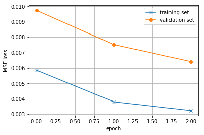
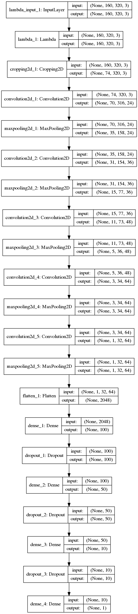
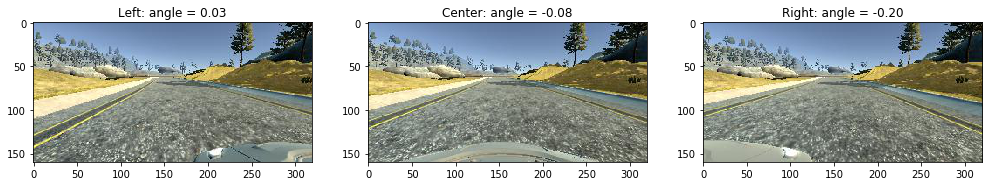
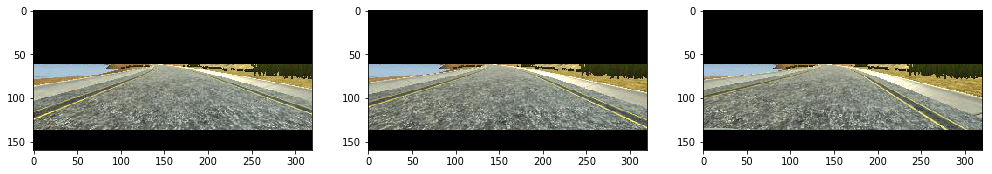
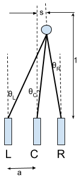

#**Behavioral Cloning** 

Ara Patapoutian, July 2017

---

**Behavioral Cloning Project**

The goals / steps of this project are the following:
* Use the simulator to collect data of good driving behavior
* Build, a convolution neural network in Keras that predicts steering angles from images
* Train and validate the model with a training and validation set
* Test that the model successfully drives around track one without leaving the road
* Summarize the results with a written report


## Rubric Points

---
###Files Submitted & Code Quality

####1. Submission files:

My project includes the following files:
* **model.ipynb** & **model.py**  containing the script to create and train the model

  * I used Jupyter notebook (ipynb) to generate code and at the end, converted to Python (py), since the project requested a python format

  * This file contains the code for training and saving the neural network

  * I did not use generators code since my computer memory was large 32 GB, and could handle the 4.8 GB size of training images 

  * cell-1 (ipynb) includes all the parameters I could tune, I started the network as the NVIDIA network

    ```
    # parameters used
    FLIP_FLAG   = True    # if True adds flipped images for training
    CROP_FLAG   = True    # if True cropps undesired portions of an image
    NORM_FLAG   = True    # if True normalizes the input to network
    RL_IM_FLAG  = True    # if True uses the left and right images as well


    IMAGE_SHAPE      = (160, 320, 3)
    TOP_CROP         = 62      # where to crop at top of image
    BOTTOM_CROP      = 24      # where to crop at bottom of image
    CAMERA_DELTA     = 0.002   # distance between cameras, assuming vertical distance is normalized 1
    PROB_LR          = 0.6     # probability of using a left/right image
    SAVED_FN         = "model.h5"
    EPOCHS           = 3
    BATCH_SIZE       = 64
    VALIDATION_SPLIT = 0.25
    KP               = 0.3     # keep prob

    # NVIDIA Network config: K=kernel, F=features, S=stride
    K = [5,  5,  5,  3,  3]
    F = [24, 36, 48, 64, 64]
    S = [2,   2,  2,  1,  1]
    FC= [100, 50, 10]
    ```

* **drive.py** for driving the car in autonomous mode

  * I ended up changing the velocity from 9 mph to 20  mph to stress the system 

* **model.h5** containing a trained convolution neural network 

  * Using the Udacity provided simulator and my drive.py file, the car can be driven autonomously around the track by executing >>> python drive.py model.h5

* **p3.md** summarizing the results

  * It is this report and covers for README file as well

* **run1.mp4** is the video capturing 1 rev of the track

###Model Architecture and Training Strategy

####1. Model architecture has been employed

- I used the NVIDIA architecture, discussed in Section 14 of the class project and covered by the NVIDIA paper  *End to End Learning for Self-Driving Cars* by M. Bojarski et al. (from now on referred as NVIDIA paper)
- This model has 5 convolution layers followed by 3 fully connected (FC) layers
  - The model includes RELU activation on all convolution and fully connected layers
- I parameterized the layer variables to easily change them if needed, see cell-1 content above
- I did an analysis on trainable parameters and obtained 346 K parameters (cell-12)
  - the NVIDIA paper reports 250 K such parameters versus my 346 K
  - I attributed the difference to the input image size $66 \times 200$ for NVIDIA, versus $74 \times 320$ for my project (after cropping)
- The code has the option to normalized the input, by using a Keras lambda layer (cell-11) using the flag NORM_FLAG
  - I tried running without normalization. I observed slower convergence and poorer car performance
  - as a result I set NORM_FLAG = True

####2. Attempts to reduce overfitting in the model

* I added dropout to all fully connected layers  except output (cell-11)
* I tried dropout on the last convolution layer but did not help
  * Ended up not using dropout on any convolution layer 
* I increased training data in multiple ways as described below

####3. Model parameter tuning

* The model used an **adam** optimizer, so the learning rate was not tuned manually (cell-12)

* I used **25% of available data** for validation

* played with BATCH_SIZE, did not make much of a difference, ended up using **BATCH_SIZE=64**

* To minimize validation loss ended up using  **EPOCHS=3** 

  * I choose this by observing training cost versus validation cost behaviors, an example plot is shown here

    

####4. Appropriate training data

* Training data was chosen to keep the vehicle driving on the road
  * validation cost was useful in training a specific network but not that useful in deciding what training data to use
  * in other words, certain data makes validation cost higher but yet the driving experience improves
* I did not use the second track because I had difficulty navigating the track and therefore had difficulty properly training the network 
* To diversify data:
  1. I used  numpy's fliplr() function that doubled my repository 
  2. I trained the car both counterclockwise and clockwise
  3. I used some of the left and right images provided during training

For details about how I created the training data, see the next section. 

###Model Architecture and Training Strategy

####1. Solution Design Approach

* After duplicating the instructor's attempts by starting with simple networks, my initial serious starting point was the NVIDIA network as described by NVIDIA paper
  - NVIDIA's network with dropout worked well from start, and as a result I focused on training data set preparation rather than network optimization
* The overall strategy for deriving a model architecture was for the car not to approach the side lanes
  * To stress the system I increase the car set-velocity to **20 mph** inside drive.py
    * as the car speed increased, two effects were observed:
      1. the car oscillated more (right/left) on straight lanes
      2. the car started missing sharp turns
    * Furthermore, these two impairments are highly correlated: as I increase the left/right camera steering angle shifts (see Appendix), the sharp turns got better but the oscillations got worst
    * Also, when I reduced the fraction of left/right camera pictures, oscillations got better but sharp turn performance degraded
    * In doing such trade-offs, I found out the validation loss not to be very helpful, I had to test drive the car after each modification
    * I ended up using small angle shifts (**a=0.0002**, see Appendix) for the side cameras,  and used **60%** of the side camera images, which I picked randomly (cell-5)

####2. Final Model Architecture

* Not counting normalization and cropping I had 5 convolution layers and 3  FC layers (cell-11)

Here is a visualization of the architecture that I obtained by using Keras SCG()  function



* The number if trainable parameters are calculated in cell-12

   Conv layer 1 complexity = 1875
   Conv layer 2 complexity = 22200
   Conv layer 3 complexity = 44100
   Conv layer 4 complexity = 28080
   Conv layer 5 complexity = 37440
  Conv complexity = 133695
   FC layer 1 complexity = 206848
   FC layer 2 complexity = 5100
   FC layer 3 complexity = 550
  FC complexity = 212498
  Total trainable parameters = **346,193**

####3. Creation of the Training Set & Training Process

* Original capture:

  * 2 laps on track counterclockwise
  * 1 lap on track clockwise
  * some sharp turns
  * for a total of $9767$ images

*  Doubled data set by using left-right flip function np.fliplr()

  * for a total of $9767 \times 2 = 19,534$ images

* Increased original data by $60\%$ by incorporating some left and right camera images

  * for a total of $31,287$ images

  * originally, I also applied right/left flip on the side cameras but then decided to not use them since I was trying to limit the side camera images, in order to control oscillations (as discussed above)

  * here is an image from the three cameras

    

  * I calculated the left and right steering angles from center angle as discussed in Appendix

* To minimize clutter,  cropped images

  * TOP_CROP               = 62      # where to crop at top of image

  * BOTTOM_CROP      = 24      # where to crop at bottom of image

  * the cropped image has $160-62-24=74$ rows of pixels

  * here is the cropped images from the three cameras

    

* I finally randomly shuffled the data set and put 25% of the data into a validation set

### Concluding Remarks

* Since the car stayed within lanes, I had to push the the speed limit from 9 to 20 mph
  * Containing oscillations and sharp turns were the main challenges I was struggling with
  * The car still oscillates on a straight line, but well within the lane lines
  * The car also performs sharp turns at high speeds
  * All this can be watched on run1.mp4
* It was interesting to observe how important the training data is for the network to be a successful one
* Other attempts
  * I tried to train on second  track but could not stay center, even at low speeds
  * I tried to put a PI and P controller on steering angle (rather than the speed), to control oscillations, without much success, a PID system may be more promising

## Appendix

- The model is shown below

  

- Normalized the vertical distance from cameras to point of interest to be 1

-  Denoted by $s$, the horizontal displacement from center camera corresponding to the steering angle $\theta_C$, 

  - $\theta_C$ and $s$ are related as follows

    $$\theta_C = \frac{180}{\pi} \tan(s) \Rightarrow s  = \arctan \left( \frac{\pi}{180} \theta \right)$$  

- If the side cameras are $a$ units to the left & right of center camera, then the associated angles $\theta_L$ & $\theta_R$ are given respectively as

  $$\theta_L = \frac{180}{\pi} \tan(s+a)$$

  $$\theta_R = \frac{180}{\pi} \tan(s-a)$$

- In summary, the parameter to be calibrated is $a$, and given $a$, the right and left angles can be calculated from $\theta_C$ in 2 steps:

  1. from $\theta_C \rightarrow s$ 
  2. from $s, a \rightarrow \theta_L, \theta_R$
